# R语言实战

## 第一章 入门

- R使用 `<-`,而不是传统的 `=` 作为赋值符号。
- 注释由符号 # 开头。

### 获取帮助

函数 | 功能
---- | ---
help.start() | 打开帮助文档首页
help("foo")或?foo | 查看函数foo的帮助(引号可以省略)
help.search("foo")或??foo | 以foo为关键词搜索本地帮助文档 
example("foo") | 函数foo的使用示例(引号可以省略)
RSiteSearch("foo") | 以foo为关键词搜索在线文档和邮件列表存档
apropos("foo", mode="function") | 列出名称中含有foo的所有可用函数
data() | 列出当前已加载包中所含的所有可用示例数据集
vignette() | 列出当前已安装包中所有可用的vignette文档 
vignette("foo") | 为主题foo显示指定的vignette文档

### 工作空间

用于管理R工作空间的函数

函数 | 功能
---- | ---
getwd() | 显示当前的工作目录
setwd("`mydirectory`") | 修改当前的工作目录为*mydirectory*
ls() | 列出当前工作空间中的对象
rm(objectlist) | 移除(删除)一个或多个对象
help(options) | 显示可用选项的说明
options() | 显示或设置当前选项
history(#) | 显示最近使用过的#个命令(默认值为25)
savehistory("myfile") | 保存命令历史到文件myfile中(默认值为.Rhistory)
loadhistory("myfile") | 载入一个命令历史文件(默认值为.Rhistory)
save.image("myfile") | 保存工作空间到文件myfile中(默认值为.RData)
save(objectlist, file="myfile") | 保存指定对象到一个文件中
load("myfile") | 读取一个工作空间到当前会话中(默认值为.RData)
q() | 退出R。将会询问你是否保存工作空间

### 输入和输出

1. 输入 函数source("filename")可在当前会话中执行一个脚本。
2. 文本输出 函数`sink`("filename")将输出重定向到文件filename中。默认情况下,如果文件已经存 在,则它的内容将被覆盖。使用参数`append=TRUE`可以将文本追加到文件后,而不是覆盖它。 参数`split=TRUE`可将输出同时发送到屏幕和输出文件中。不加参数调用命令sink()将仅向屏幕 返回输出结果。
3. 图形输出

函数 | 输出
--- | ---
pdf("filename.pdf") | PDF文件
win.metafile("filename.wmf") | Windows图元文件
png("filename.png") | PNG文件
jpeg("filename.jpg") | JPEG文件
bmp("filename.bmp") | BMP文件
postscript("filename.ps") | PostScript文件

最后使用dev.off()将输出返回到终端。

### 包

包是R函数、数据、预编译代码以一种定义完善的格式组成的集合。计算机上存储包的目录 称为库(library)。函数.libPaths()能够显示库所在的位置, 函数library()则可以显示库中 有哪些包。

R自带了一系列默认包(包括base、datasets、utils、grDevices、graphics、stats 以及methods),它们提供了种类繁多的默认函数和数据集。其他包可通过下载来进行安装。安装 好以后,它们必须被载入到会话中才能使用。命令search()可以告诉你哪些包已加载并可使用。

#### 包的安装

- install.packages()
- update.packages()
- installed.packages()

#### 包的载入

- library()

### 批处理

R CMD BATCH options infile outfile

## 第二章 创建数据集

### 数据集的概念

不同的行业对于数据集的行和列叫法不同。统计学家称它们为观测(observation)和变量 (variable),数据库分析师则称其为记录(record)和字段(field),数据挖掘/机器学习学科的研究者则把它们叫做示例(example)和属性(attribute)。

### 数据结构

R拥有许多用于存储数据的对象类型,包括标量、向量、矩阵、数组、数据框和列表。

#### 向量

- 向量是用于存储数值型、字符型或逻辑型数据的一维数组。执行组合功能的函数c()可用来创建向量。
- *注意,单个向量中的数据必 须拥有相同的类型或模式(数值型、字符型或逻辑型)。标量是只含一个元素的向量。*
- 通过在方括号中给定元素所处位置的数值

### 矩阵

矩阵是一个二维数组,只是每个元素都拥有相同的模式(数值型、字符型或逻辑型)。可通过函数`matrix`创建矩阵。

```R
my_matrix <- matrix(vector, nrow = number_of_row, ncol = number_of_columns,
                    byrow = logical_value, dimnames = list(
                    char_vector_rownames, char_vector_colnames))
```

其中vector包含了矩阵的元素,nrow和ncol用以指定行和列的维数,dimnames包含了可选的、 以字符型向量表示的行名和列名。选项byrow则表明矩阵应当按行填充(byrow=TRUE)还是按 列填充(byrow=FALSE),默认情况下按列填充。

### 数组

数组(array)与矩阵类似,但是维度可以大于2。

```R
my_array <- array(vector, dimensions ,dimnames)
```

其中vector包含了数组中的数据,dimensions是一个数值型向量,给出了各个维度下标的最大值,而dimnames是可选的、各维度名称标签的列表。

### 数据框

数据框可通过函数data.frame()创建

```R
my_data <- data.frame(col1, col2, col3, ...)
```

- attach()、detach()和with()
- 如果需要创建在with()结构以外存在的对象,使用特殊赋值符<<-替代标准赋值符(<-) 即可,它可将对象保存到with()之外的全局环境中。

### 因子

变量可归结为名义型、有序型或连续型变量。名义型变量是没有顺序之分的类别变量。有序型变量表示一种顺序关系,而非数量关系。连续型变量可以呈现为某个范围内的任意值,并同时表示了顺序和数量。

类别(名义型)变量和有序类别(有序型)变量在R中称为因子(factor)。因子在R中非常重要,因为它决定了数据的分析方式以及如何进行视觉呈现。

函数factor()以一个整数向量的形式存储类别值,整数的取值范围是[1... k](其中k是名义型变量中唯一值的个数),同时一个由字符串(原始值)组成的内部向量将映射到这些整数上。要表示有序型变量,需要为函数factor()指定参数ordered=TRUE。

对于字符型向量,因子的水平默认依字母顺序创建。可以通过指定levels选项来覆盖默认排序。

```
str(obj)        # 显示对象的结构
summary(obj)    # 显示对象的统计概要
```

### 列表

列表(list)是R的数据类型中最为复杂的一种。一般来说,列表就是一些对象(或成分,component)的有序集合。列表允许整合若干(可能无关的)对象到单个对象名下。

可以通过在双重方括号中指明代表某个成分的数字或名称来访问列表中的元素。

由于两个原因,列表成为了R中的重要数据结构。首先,列表允许以一种简单的方式组织和重新调用不相干的信息。其次,许多R函数的运行结果都是以列表的形式返回的。需要取出其中哪些成分由分析人员决定。

> 对象名称中的句点(.)没有特殊意义。但美元符号($)却有着和其他语言中的句点类似的含义,即指定一个对象中的某些部分。
> R不提供多行注释或块注释功能。
> 将一个值赋给某个向量、矩阵、数组或列表中一个不存在的元素时,R将自动扩展这个数据结构以容纳新值。
> R中没有标量。标量以单元素向量的形式出现。
> R中的下标不从0开始,而从1开始。
> 变量无法被声明。它们在首次被赋值时生成。

### 数据的输入

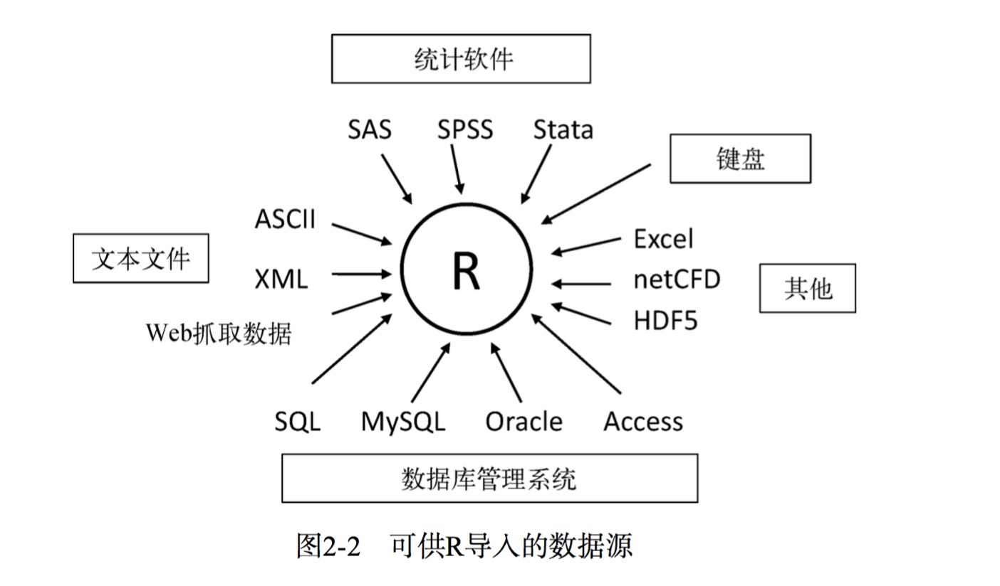

- R中的函数edit()会自动调用一个允许手动输入数据的文本编辑器。
- 从带分隔符的文本文件导入数据,使用read.table()从带分隔符的文本文件中导入数据。此函数可读入一个表格格式的文件并将其保存为一个数据框。
    `read.table(file, header = logical_value, sep = "delimiter", row.names = "name")`,其中,file是一个带分隔符的ASCII文本文件,header是一个表明首行是否包含了变量名的逻辑值(TRUE或FALSE),sep用来指定分隔数据的分隔符,row.names是一个可选参数,用以指定一个或多个表示行标识符的变量。
- 导入Excel数据
    包中的函数read.xlsx()可将XLSX文件中的工作表导入为一个数据框。其最简单的调用格式是`read.xlsx(file, n)`,其中file是Excel 2007工作簿的所在路径,n则为要导入的工作表序号。
- 导入XML数据
    XML包
- 从网页抓取数据
    RCurl包
- 导入SPSS数据
    SPSS数据集可以通过foreign包中的函数read.spss()导入到R中,也可以使用`Hmisc`包中 的spss.get()函数。函数spss.get()是对read.spss()的一个封装,它可以为你自动设置后者的许多参数,让整个转换过程更加简单一致,最后得到数据分析人员所期望的结果。
- 导入SAS数据
- 导入Stata数据
- 导入netCDF数据
    ncdf包和ncdf4包
- 导入HDF5 数据
    HDF5(Hierarchical Data Format,分层数据格式)是一套用于管理超大型和结构极端复杂数据集的软件技术方案。
- 访问数据库管理系统
    R中有多种面向关系型数据库管理系统(DBMS)的接口,包括Microsoft SQL Server、Microsoft Access、MySQL、Oracle、PostgreSQL、DB2、Sybase、Teradata以及SQLite。其中一些包通过原生的数据库驱动来提供访问功能,另一些则是通过ODBC或JDBC来实现访问的。
    install.packages("RODBC")
    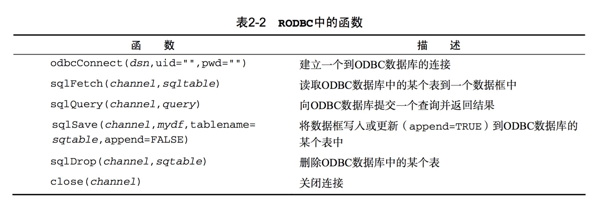
    DBI相关包
- 通过Stat/Transfer导入数据

### 数据集的标注

- 变量标签
- 值标签

### 处理数据对象的实用函数

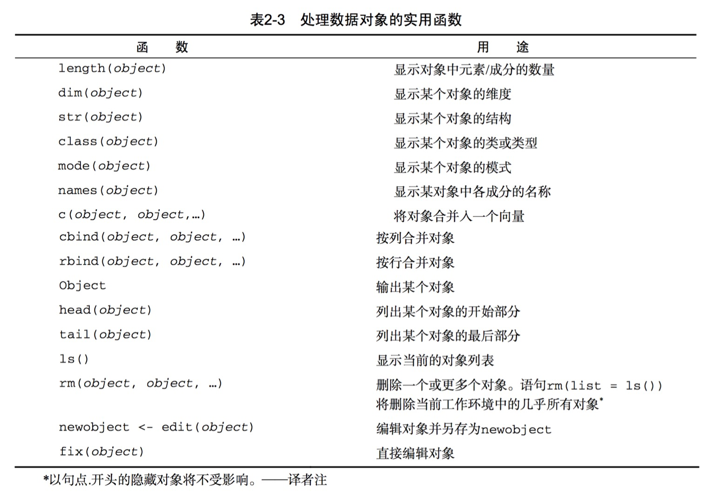

## 第三章 图形初阶

要通过代码保存图形,将绘图语句夹在开启目标图形设备的语句和关闭目标图形设备的语句之间即可。

```R
pdf("my_graph.pdd")
    attach(mtcars)
    plot(wt, mpg)
    abline(lm(mpg~wt))
    title("Regression of MPG on Weight")
    detach(mtcars)
dev.off()
```

可以使用函数`dev.new()`、`dev.next()`、`dev.prev()`、`dev.set()`和`dev.off()`同时打开多个图形窗口,并选择将哪个输出发送到哪个窗口中。这种方法全平台适用。关于这种方法的更多细节,请参考`help(dev.cur)`。

### 图形参数

(修改图形参数的)一种方法是通过函数par()来指定这些选项。其调用格式为par(optionname=value,optionname=name,...)。不加参数地执行par()将生成一个含有当前图形参数设置的列表。添加参数no.readonly=TRUE可以生成一个可以修改的当前图形参数列表。

指定图形参数的第二种方法是为高级绘图函数直接提供optionname=value的键值对。这种情况下,指定的选项仅对这幅图形本身有效。

#### 符号和线条

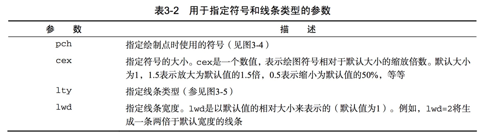

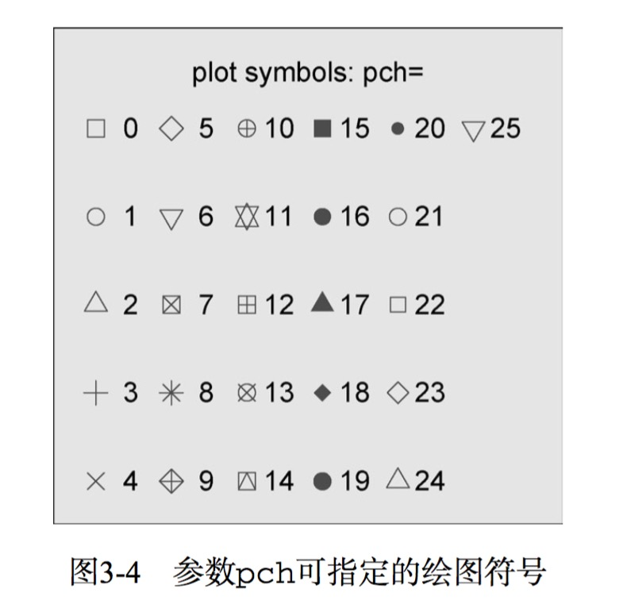

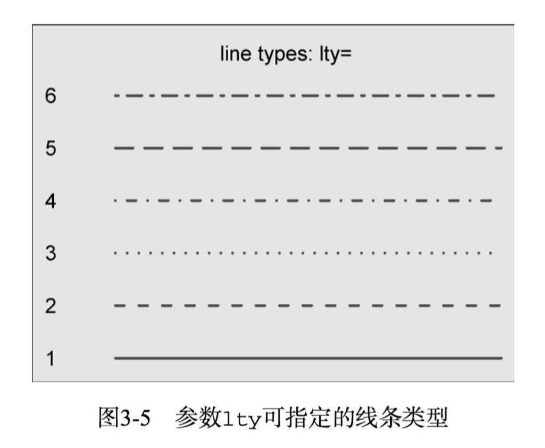

#### 颜色

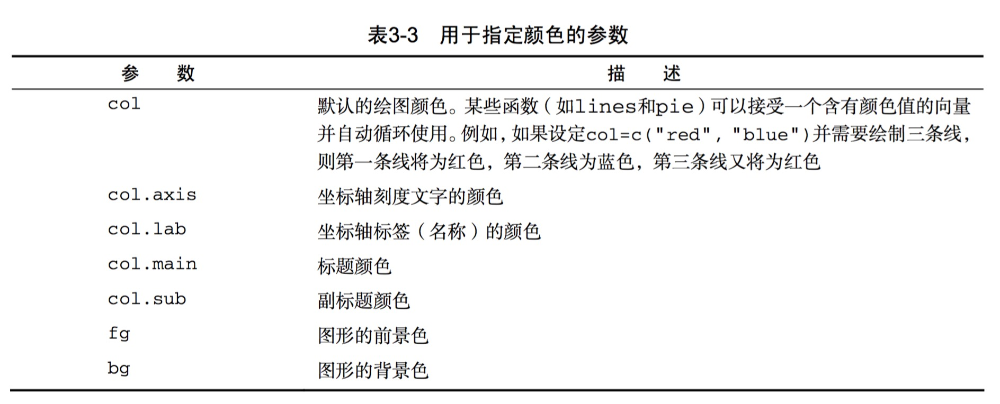

在R中,可以通过颜色下标、颜色名称、十六进制的颜色值、RGB值或HSV值来指定颜色。

函数colors()可以返回所有可用颜色的名称。[color table](http://research.stowers-institute.org/efg/R/Color/Chart/)

R中也有多种用于创建连续 型颜色向量的函数,包括rainbow()、heat.colors()、terrain.colors()、topo.colors() 以及cm.colors()。

多阶灰度 色可使用gray()函数生成。

#### 文本属性

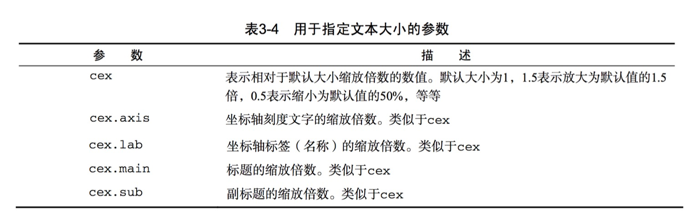

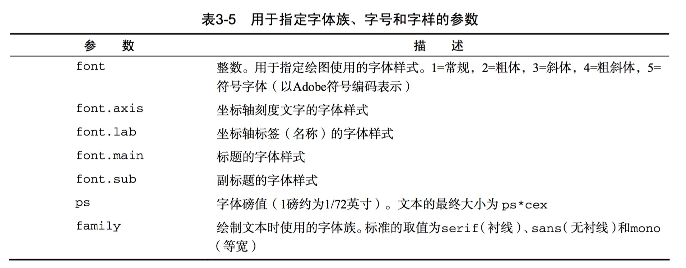

#### 图形尺寸与边界尺寸

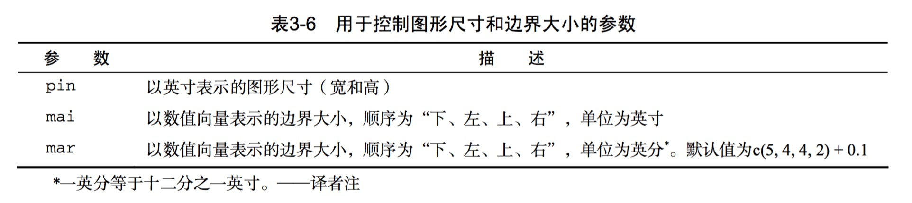

### 添加文本、自定义坐标轴和图例

#### 标题

使用title()函数为图形添加标题和坐标轴标签。

```R
title(main = "main title" sub = "sub-title",
      xlab = "x-axis label", ylab = "y-axis label")
```

#### 坐标轴

使用函数axis()来创建自定义的坐标轴,而非使用R中的默认坐标轴。

```R
axis(side, at = , labels = , pos = , lty = , col = , las = , tck = , ...)
```

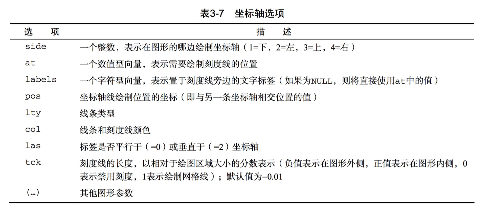

创建自定义坐标轴时,应当禁用高级绘图函数自动生成的坐标轴。参数axes=FALSE将禁用全部坐标轴(包括坐标轴框架线,除非添加了参数frame.plot=TRUE)。参数xaxt="n"和yaxt="n"将分别禁用X轴或Y轴(会留下框架线,只是去除了刻度)。

#### 参考线

函数abline()可以用来为图形添加参考线。

```R
abline(h = yvalues, v = xvalues)
```

#### 图例

当图形中包含的数据不止一组时,图例可以辨别出每个条形、扇形区域或折线各代表哪一类数据。可以使用函数legend()来添加图例。

```R
legend(location, title, legend, ...)
```

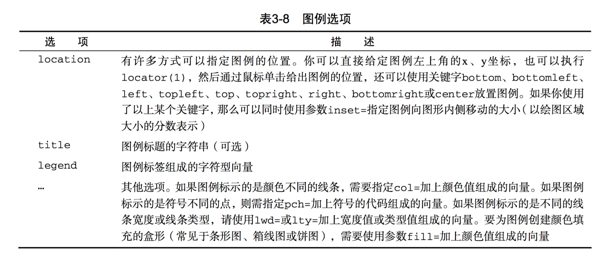

更多细节,请参考help(legend)。

#### 文本标注

可以通过函数text()和mtext()将文本添加到图形上。text()可向绘图区域内部添加文本,而mtext()则向图形的四个边界之一添加文本。 

```R
text(location, "text to place", pos, ...)
mtext("text to place", side, line = n, ...)
```

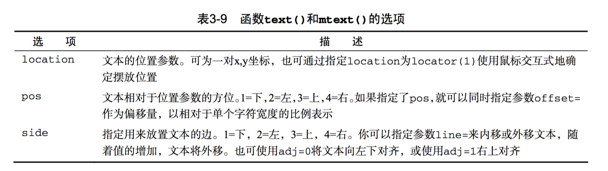

其他常用的选项有cex、col和font(分别用来调整字号、颜色和字体样式)。

#### 数学标注

可以使用类似于TeX中的写法为图形添加数学符号和公式。参阅help(plotmath)

`demo(plotmath)`

### 图形的组合

在R中使用函数par()或layout()可以容易地组合多幅图形为一幅总括图形。


